### Metal Stamp Character Recognition

This is a **special** tutorial which shows how you can use basic computer vision techniques to extract characters from metal surfaces.

This is what the final result looks like.

> 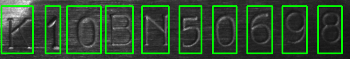

> ````
> >> Loading Code
> >> Reading image
> >> Resizing input image by width = 900px
> >> Finding vertical scharr gradient
> >> Generating Horizontal projection to find text
> >> Cropping Text Roi
> >> Removing Noise from cropped Text Roi
> >> Finding canny edge for text segmentation
> >> Generating vertical projection
> >> Segmenting individual Characters
> 
> OCR: K10BN50698
> ````

Though achieving this result was not easy, it includes a series of operation on the image one after another. After extracting feature i.e., localizing each characters position the extracted character was feed to a K-NN classifier which does the actual character recognition. However due to limited data i was not able to train the model for all the character.

One thing to keep in mind the codes in this repository explain the power of computer vision to extract certain features from images. it is not meant to be used in production environment as due to various lighting conditions it could not perform well, but many techniques from this repository can be helpful for feature extraction in other scenarios.

**Let's quickly see other inter processed images saved at every stage of processing.**

> Input Image
>
> 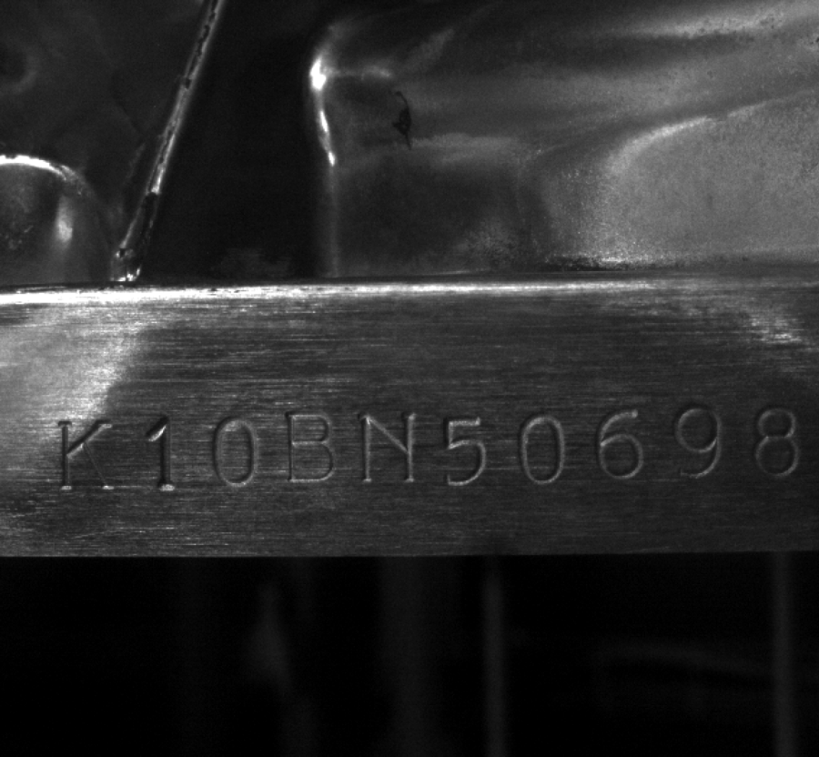

> Extracting vertical schaar gradients
>
> 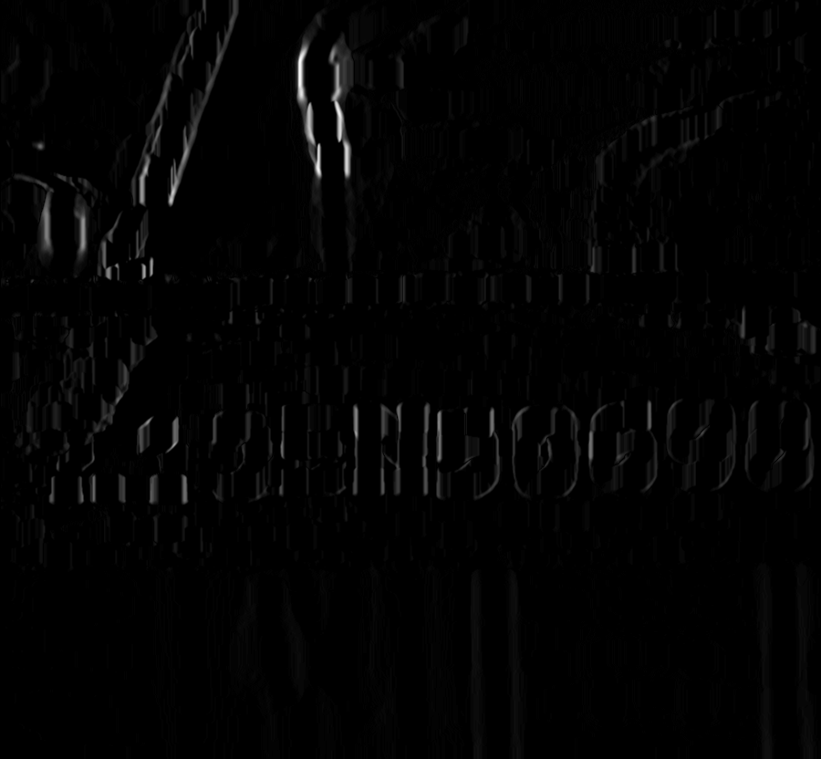

> Finding Horizontal projections from those gradients for ROI extraction
>
> 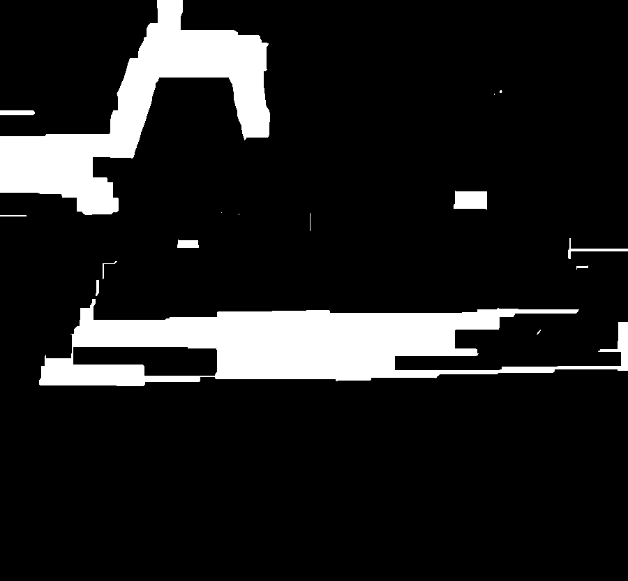

> Cropping our ROI
>
> 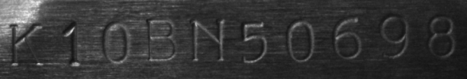

> Removing Noise
>
> 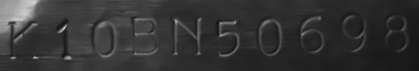

> Canny Edge Detection
>
> 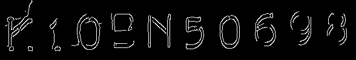

> Vertical Projections for Character Segmentation
>
> 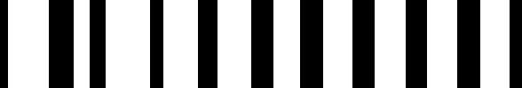

> Finally drawing bounding box on segmented characters
>
> 

This was all the Techniques used to reach to this point to be able to segment each character for classification, after that K-NN algorithm is used for the classification.

> Extracted Characters
>
> 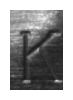 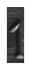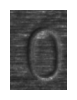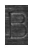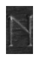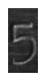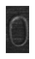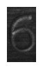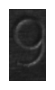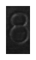

Hope you enjoyed the Project, Don't forget to **star** the repository.

**Connect me**

*mneonizer@gmail.com*

*twitter/imneonizer*

*insta/the.nitin.rai*